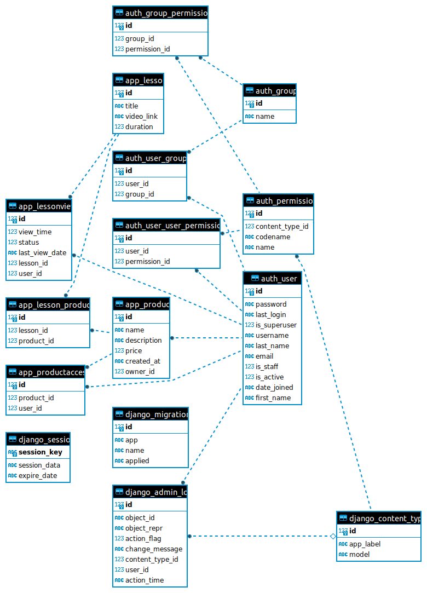

# HardQode_solution

HardQode_solution - backend-сервис на основе Django REST Framework, представляющий собой учебный портал с курсами различных категорий. В каждый курс входит каталоге уроков. Некоторые уроки состоят в нескольких курсах. Сервис предоставляет пользователю доступ к списку доступных ему уроков, на приобретеных курсах. Также пользователь получает доступ к детальной статистике по всем курсам. База данных - `SQLite`. Зависимости - `Poetry`. Линтеры - `Black`, `Flake8`. Контейнеризация - `Docker`

## Описание схемы БД
База данных содержит 4 модели: Product(Учебный курс), ProductAccess(Доступ к курсу), Lesson(Урок), LessonView(Просмотр урока). Ниже представлена графическая схема моделей и их взаимосвязей.



## Краткая документация API
Исчерпывающую информацию по работе API можно получить после запуска. Документация на основе Swagger, в соответствии со стандартом OpenAPI.

## Инструкция по установке
1. Подготовка проекта

1.1 Клонируете репозиторий
```sh
git clone https://github.com/XanderMoroz/HardQode_task.git
```

1.2 В корневой папки клонированного репозитория создаете файл .env.dist

1.3 В файлe .env.dist создаете переменную DJANGO_SECRET_KEY и присваиваете ей случайный код. Например:

```sh
DJANGO_SECRET_KEY=h9wehc98wh393ewcb9h988h2387gf2g8g32fb382gf78027vf38g780237g38738g9f
```
2 Запуск проекта с Doker

2.1 Создаете и запускаете контейнер через терминал:
```sh
sudo docker-compose up --build
```
2.2 Сервис доступен по адресу: http://0.0.0.0:8000/
